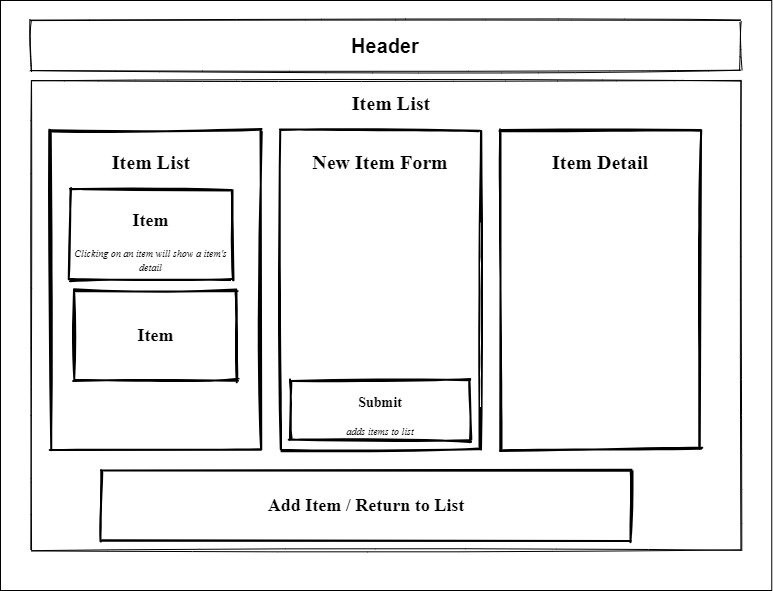

# _Merch Site _

#### _September 9-10, 2020 | Fatma C. Dogan_

## Description

_a website for selling merchandise_

<!-- _View the live site at:_  -->


### Component Diagram



## Specification user stories:
* A user should be able to create, read, update, and delete items in the store.
* A user should be able to buy an item in the store, which reduces item quantity by 1.
* A user should be able to restock an item, which increases item quantity by a fixed amount.
* When the quantity of an item is 0, the item should say "out of stock". A user should not be able to reduce the quantity of an item below 0.

## Setup/Installation Requirements

#### Node install

###### For macOS:
_If Homebrew is not installed on your computer already, then install Homebrew by entering the following two commands in Terminal:_
* $ /usr/bin/ruby -e "$(curl -fsSL https://raw.githubusercontent.com/Homebrew/install/master/install)"
* $ echo 'export PATH=/usr/local/bin:$PATH' >> ~/.bash_profile

_Install Git with the following command:_
* $ brew install git

_Next, install Node.js by entering the following command in Terminal:_
* $ brew install node

###### For Windows:
_Please visit the [Node.js website](https://nodejs.org/en/download/) for installation instructions._

#### Install this application

_Clone this repository via Terminal using the following commands:_
```
cd desktop
<!-- git clone https:// -->
<!-- cd merch-site -->
```

_Next, install npm at the project's root directory, and start the server:_
```
npm install
npm start
```

_If everything is correct, the localhost site should open automatically_

_View the contents of this project by opening in VSCode:_
```
code .
```


## Technologies Used

* _React_
* _JavaScript_
* _WebPack_
* _CSS_
* _Git_

### License

*This webpage is licensed under the MIT license.*

Copyright &copy; 2020 **_Fatma C. Dogan_**
